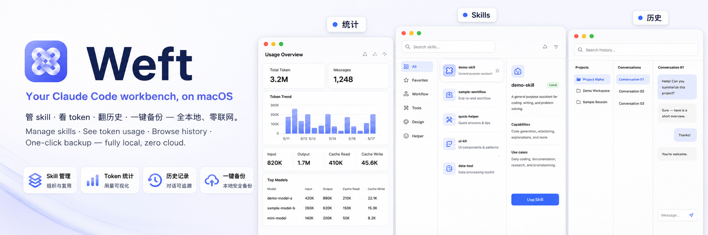

<p align="center">
  
</p>

<h1 align="center">Weft</h1>

<p align="center">
  <b>Find the right Claude skill in seconds — without scrolling.</b><br/>
  A native macOS app to browse, search, and demo your Claude Code skill library.
</p>

<p align="center">
  <a href="#install">Install</a> ·
  <a href="#features">Features</a> ·
  <a href="#how-it-works">How it works</a> ·
  <a href="#roadmap">Roadmap</a> ·
  <a href="#license">License</a>
</p>

---

## Why

When your `~/.claude/skills/` folder grows past 30 entries, you stop remembering which skill does what. The Claude Code skill list becomes a wall of names that all look vaguely useful.

Weft reads your local skill files and turns them into a searchable, browsable library — so you can find the one you need without scrolling through 50+ items every time.

## Features

- **Fast fuzzy search** across skill name, description, and trigger words (`⌘K`)
- **Auto-grouping** by category — meta tools, work-internal, design, life scenarios, etc.
- **Usage stats** scanned from your Claude Code session history. See what you actually use vs. what's gathering dust.
- **One-click slash command copy** — paste `/skill-name` straight into Claude Code
- **Presentation mode** (`⌘D`) — large-text, centered layout for screen-sharing or team demos
- **Pure local** — reads your filesystem only. Sends nothing to the network.

## Install

### Option A — build from source

Requires **Node 18+**, **Rust stable**, and **Xcode command-line tools**.

```bash
git clone https://github.com/WyattLee-nanami/weft
cd weft
npm install
npm run tauri build
open src-tauri/target/release/bundle/macos/Weft.app
```

### Option B — download a release

Pre-built `.dmg` files will be available under [Releases](../../releases) once v0.1.0 is published.

First launch: macOS will block an unsigned app. Go to **System Settings → Privacy & Security**, scroll down, click **Open Anyway**.

## How it works

```
~/.claude/skills/<name>/SKILL.md   ──┐
                                     ├─→  scan-skills.mjs  ─→  src/skills.json  ─→  React UI
~/.claude/projects/**/*.jsonl      ──┘                                                 │
   (usage counting)                                                                Tauri shell
                                                                                       │
                                                                                  Weft.app
```

The scanner runs at build time, parsing each `SKILL.md` frontmatter (name, description, triggers) and counting how often each skill name appears in your local Claude Code session history.

The result is bundled as static JSON into the app, then rendered by a React + Fuse.js front-end inside a Tauri 2 shell.

## Tech stack

- **Tauri 2** — native macOS shell, ~10 MB bundle, Rust backend
- **React 18 + TypeScript** — front-end
- **Fuse.js** — fuzzy search
- **react-markdown + remark-gfm** — render SKILL.md body

## Roadmap

- [ ] **v0.2** — Live Rust-side scanner so the app re-indexes without rebuilding
- [ ] **v0.3** — Duplicate detection (embedding-based similarity for overlapping skills)
- [ ] **v0.4** — Team mode: serve a read-only HTML view from a shared skill repo
- [ ] **v0.5** — Edit skills inline (frontmatter + body) with live preview

## Contributing

Bug reports and PRs welcome. The codebase is small (~500 lines of TS + a tiny Rust shell) and intentionally minimal.

## License

MIT — see [LICENSE](./LICENSE).

---

<p align="center">
  <sub>Built because opening 50+ skill names every time was the bottleneck — the index, not the skills, was broken.</sub>
</p>
